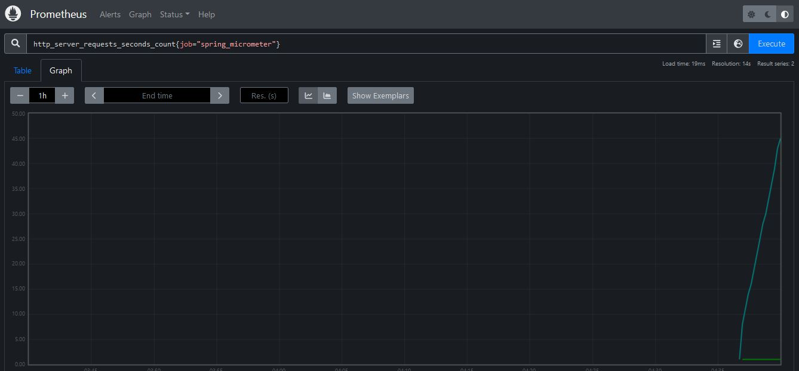
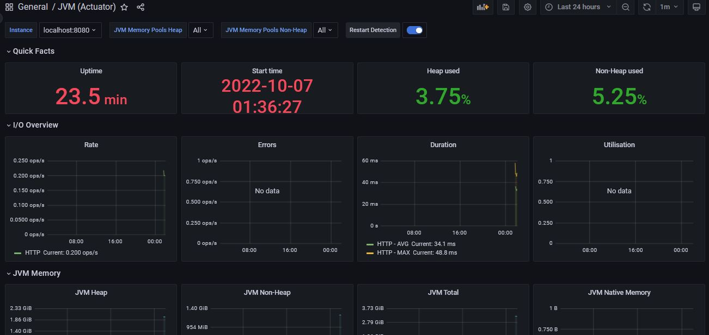

### Instalação do Prometheus
* Acessar o site oficial do Prometheus e baixar o zip que contém o executável. Nesse projeto utilizamos a versão **2.39.0**, que já vem com exporters para monitoramento de sistemas e banco de dados
* Extrair o zip e executar o arquivo **prometheus.exe**, que faz subir o servidor do Prometheus na **porta 9090**
* Acessar o endereço **http://locahost:9090** no navegador, o console do Prometheus deve ser exibido com sucesso

### Instalação do Grafana
* Acessar o site oficial do Grafana e baixar o zip que contém o executável. Nesse projeto utilizamos a versão **9.1.7**
* Extrair o zip e executar o arquivo **bin/grafana-server.exe**, que faz subir o servidor do Grafana na **porta 3000**
* Acessar o endereço **http://locahost:3000** no navegador, o console do Grafana deve ser exibido com sucesso

**Obs:** o usuário e senha padrão para primeiro acesso é "admin"

### Integração Prometheus x Grafana
* Acessar o console do **Grafana** e criar um novo **Data Source**
* Na sua configuração, informar o **tipo** "Prometheus", a **URL** do Prometheus local (http://locahost:9090) e o **access** com a opção "Server"
* As outras configurações (autenticação, alertas, etc) deixamos com o valor padrão
* Rodar a aplicação **java/spring boot** na **porta 8080**. Podemos acessar as **métricas** expostas pelo Actuator/Prometheus através do endereço **http://localhost:8080/actuator/prometheus**
* Acessar o diretório de instalação do Prometheus e alterar o arquivo **prometheus.yml**, adicionando o **job** da nossa aplicação java e diminuindo o **scrape interval global** para 10 segundos:

``` 
global:
  scrape_interval: 10s
 
scrape_configs:
  - job_name: 'spring_micrometer'
    metrics_path: '/actuator/prometheus'
    scrape_interval: 5s
    static_configs:
      - targets: ['localhost:8080']
```

* Com isso, nossa aplicação estará integrada com o Prometheus e, para testar, podemos acessar o console do **Prometheus** e executar a seguinte query: **http_server_requests_seconds_count{job="spring_micrometer"}**



* Para visualizar as métricas graficamente no Grafana, precisamos **criar um dashboard** ou **importar** um dos diversos dashboards disponibilizados pelo Grafana
* Para esse exemplo, importaremos o **JVM Actuator Dashboard** (https://grafana.com/grafana/dashboards/9568-jvm-actuator/) utilizando a função de **importar dashboards** e configuramos ele com a **folder** General e o **Data Source** do tipo Prometheus criado no início deste tópico
* Após isso, ao acessar o dashboard teremos diversos painéis exibindo diferentes métricas expostas pelo Actuator/Prometheus da nossa aplicação



**Obs:** Como temos **acesso ao servidor** do Prometheus podemos usar o access "Server", caso contrário precisaríamos usar o access "Browser"

### Referências:
https://prometheus.io/docs/prometheus/latest/installation/
https://github.com/prometheus/prometheus/releases/download/v2.39.0/prometheus-2.39.0.windows-amd64.zip
https://grafana.com/docs/grafana/v9.0/setup-grafana/installation/
https://dl.grafana.com/oss/release/grafana-9.1.7.windows-amd64.zip
https://programmersought.com/article/37905525090/
https://grafana.com/grafana/dashboards/9568-jvm-actuator/